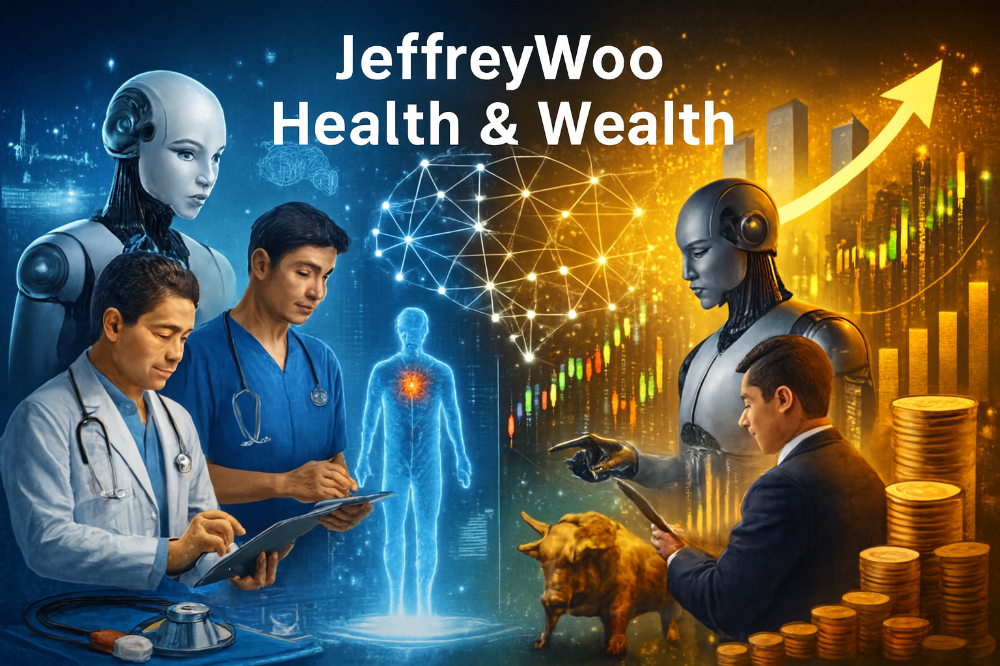
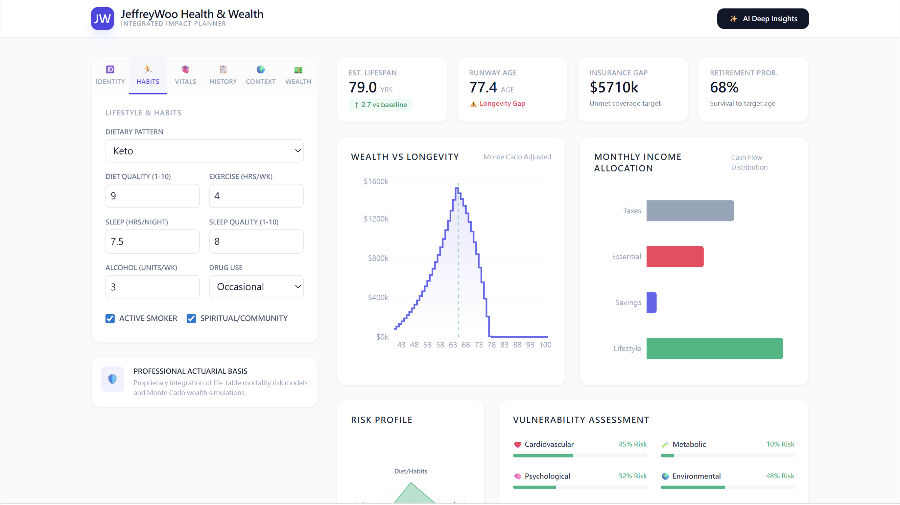
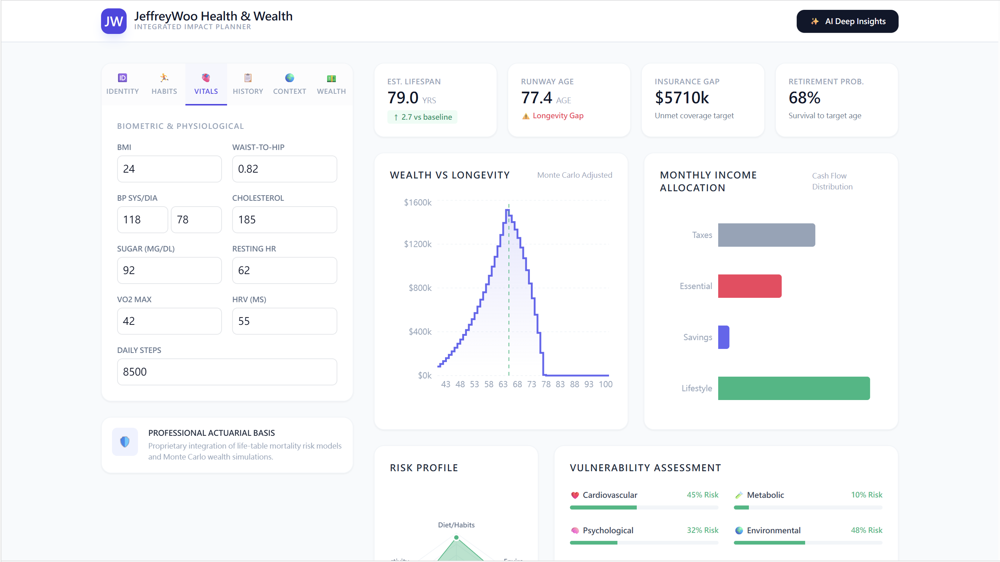
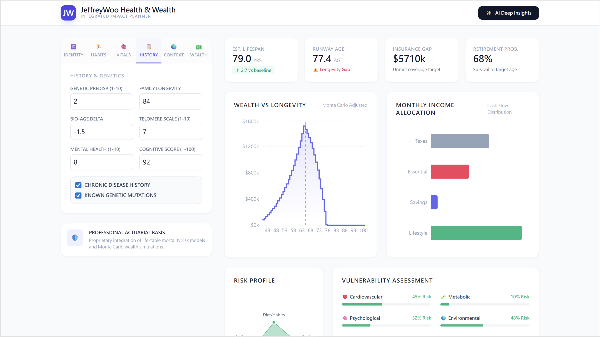
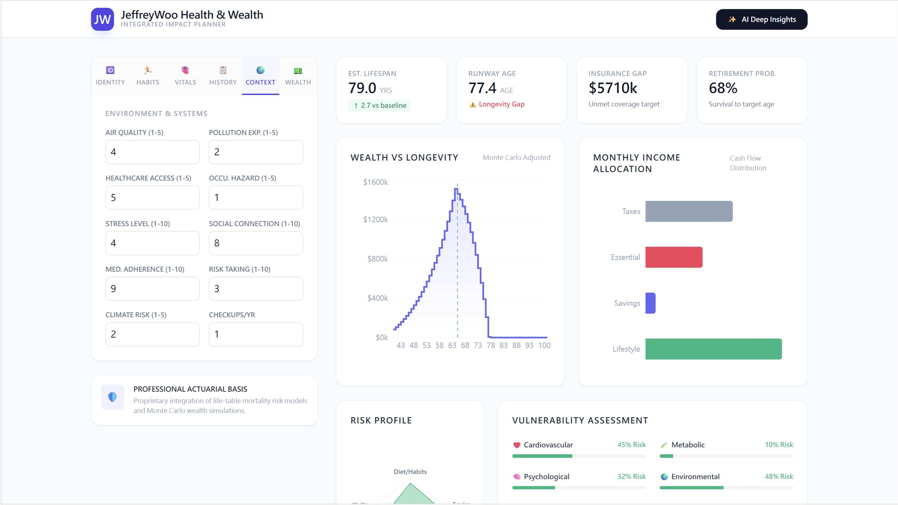
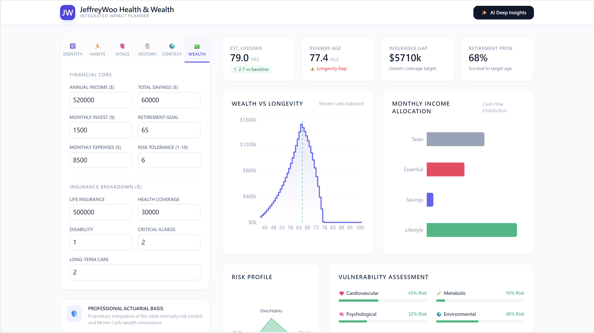
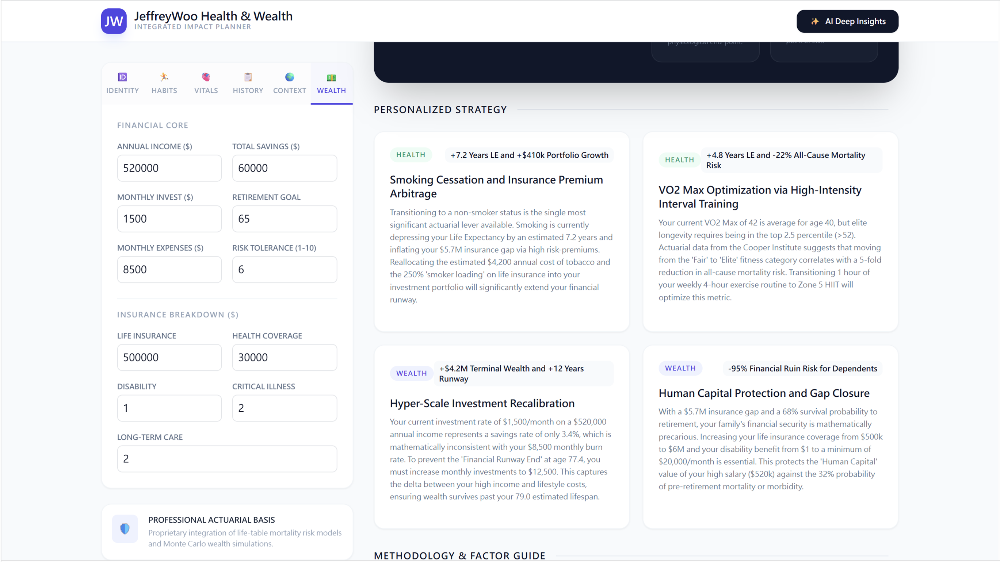

Not your typical health or finance app.  

**JeffreyWoo Health & Wealth** is an AI-powered health and wealth planner designed to help individuals make smarter, healthier, and more confident lifestyle and financial choices.

## ✨ What It Does
- 🩺 **Probabilistic Health Insights** — assess lifestyle, environment, and medical history to estimate health risks and lifespan impact  
- 📊 **Wealth Planning Guidance** — generate personalized savings, investment, and retirement strategies aligned with health scenarios  
- 🔍 **Scenario Simulation** — explore "what-if" models (e.g., quitting smoking, exercising weekly) to see combined health + wealth outcomes  
- 📈 **Visualization Dashboards** — interactive charts for health risk, wealth projections, and dual impact analysis  
- 🔒 **Secure & Compliant** — built with encrypted databases, GDPR/PDPO compliance, and reproducible workflows  

## 🚀 Why Choose JeffreyWoo Health & Wealth?
Most apps focus only on health or finance. **JeffreyWoo Health & Wealth** goes further — integrating actuarial science, medical research, socio-economic data, and financial planning models into one AI-powered platform. It helps you anticipate risks, plan smarter, and align your lifestyle with long-term financial security.

## 📦 Getting Started
1. Enter your personal data — demographics, lifestyle habits, medical/family history, environment, socio-economic, and financial details.  
2. Let **JeffreyWoo Health & Wealth** analyze your profile using professional actuarial models, AI/ML, and financial simulations.  
3. Explore your personalized dashboards — health risk radar, wealth projections, and scenario simulations.  
4. Review AI-powered recommendations for healthier habits and smarter financial planning.  
5. Export your insights as a PDF report to share with advisors or keep for personal tracking.

## ⚖️ Disclaimer
**JeffreyWoo Health & Wealth** provides AI-driven insights for educational and informational purposes only. It does not predict exact health outcomes, death dates, or guarantee financial results. All outputs are probabilistic assessments based on professional actuarial models, medical research, socio-economic data, and financial planning assumptions. It is not a substitute for professional medical diagnosis, treatment, or financial advice. Users should consult qualified healthcare providers and licensed financial advisors before making health or investment decisions.  

## ⚙️ Run Locally

**Prerequisites:**  Node.js

1. Install dependencies:
   `npm install`
2. Set the `GEMINI_API_KEY` in [.env.local](.env.local) file to your API key after you create [.env.local](.env.local) file
3. Run the app:
   `npm run dev`

## 📋 Sample

