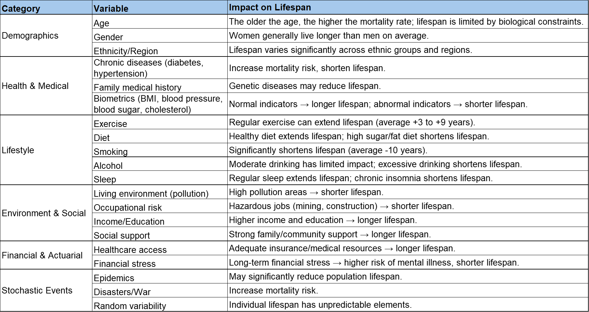
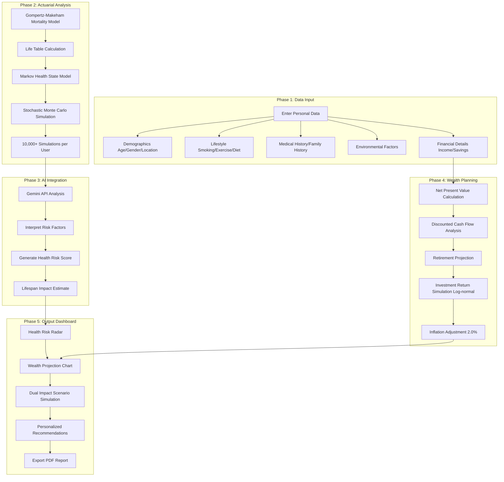
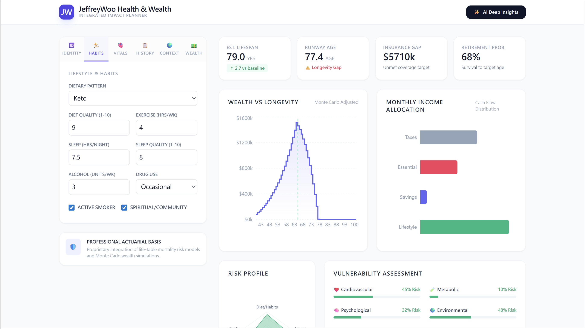
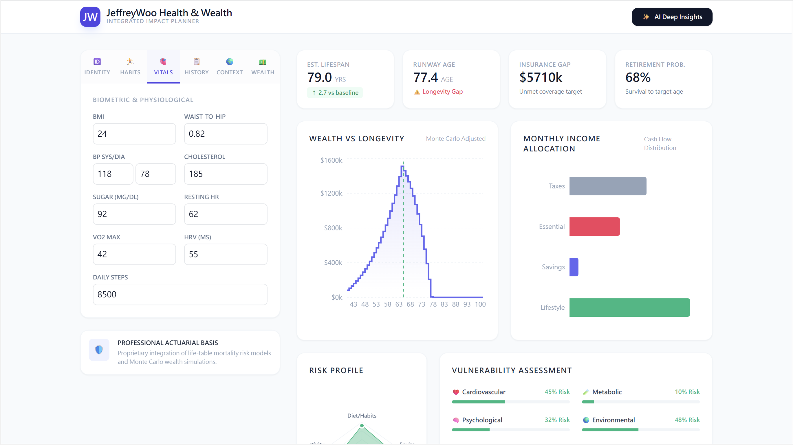
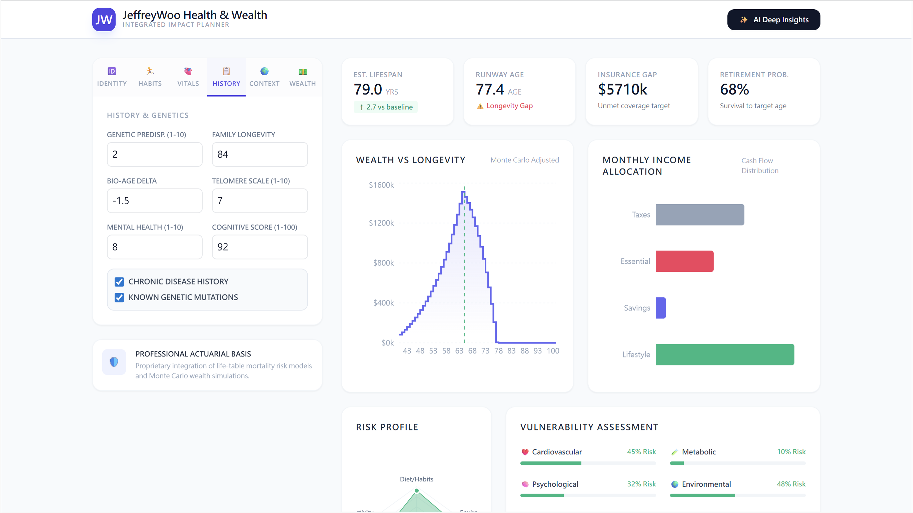
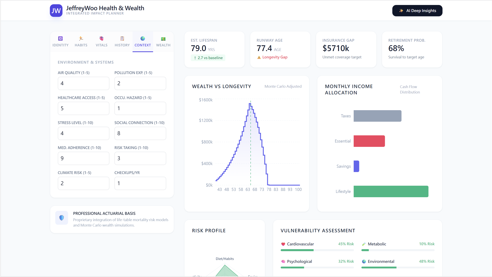
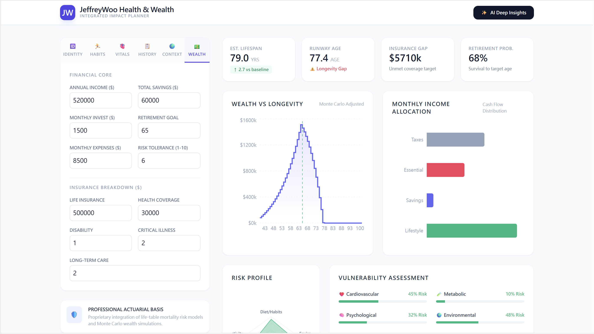
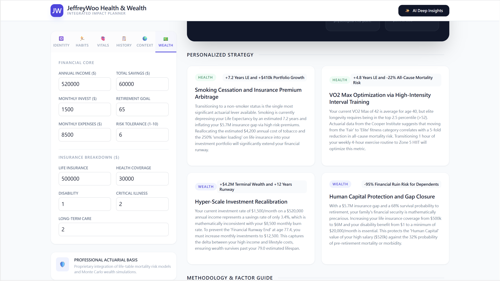

## 📊 Overview

> **Not your typical health or finance app!**

**JeffreyWoo Health & Wealth** is an AI-powered health and wealth planner designed to help individuals make smarter, healthier, and more confident lifestyle and financial choices.

## ✨ What It Does
- 🩺 **Probabilistic Health Insights** — assess lifestyle, environment, and medical history to estimate health risks and lifespan impact  
- 💵 **Wealth Planning Guidance** — generate personalized savings, investment, and retirement strategies aligned with health scenarios  
- 🔍 **Scenario Simulation** — explore "what-if" models (e.g., quitting smoking, exercising weekly) to see combined health + wealth outcomes  
- 📈 **Visualization Dashboards** — interactive charts for health risk, wealth projections, and dual impact analysis  
- 🔒 **Secure & Compliant** — built with encrypted databases, GDPR/PDPO compliance, and reproducible workflows  

## 💡 Finance Transformation Impact
This project exemplifies how AI reshapes finance by:  
- Driving digital transformation in personal finance and wealth planning by integrating AI to deliver predictive insights, scenario modeling, and automated financial guidance.  
- Unifying actuarial science, medical research, and financial planning into a user‑centric intelligence platform that elevates risk assessment, long‑term planning, and data‑driven financial decisions.  
- Enhancing decision‑making through interactive dashboards and simulations that convert complex actuarial and financial data into clear, actionable insights for strategic planning.  
- Advancing innovation in financial modeling with strong emphasis on data privacy, ethical AI practices, and responsible analytics to support compliant and trustworthy financial decision‑making.  

**Note:** The core logic of the personal longevity risk model established in this project can also be applied to the actuarial assessment of corporate pension liabilities or insurance cost analysis.

## 🚀 Why Choose JeffreyWoo Health & Wealth?
Most apps focus only on health or finance. **JeffreyWoo Health & Wealth** goes further — integrating actuarial science, medical research, socio-economic data, and financial planning models into one AI-powered platform. It helps you anticipate risks, plan smarter, and align your lifestyle with long-term financial security.

## 📉 Actuarial Models Applied
This app integrates actuarial science models into AI-driven health and wealth planning. It combines demographic, lifestyle, medical, and socio-economic data to estimate lifespan impact, morbidity risks, and financial sustainability:  
- **Gompertz-Makeham Law of Mortality**  — Used to model age-dependent mortality rates, capturing both natural aging effects and external risk factors. Gompertz function (age-dependent) represents the exponential increase in mortality with age (senescence); whereas Makeham term (age-independent) represents constant background mortality from external causes, such as accidents or infections. This allows the app to forecast survival probabilities under different lifestyle scenarios.   
- **Life Tables & Survival Analysis** — Standard actuarial tables are applied to estimate expected lifespan and conditional survival probabilities, forming the foundation for personalized health projections.
*Note: Data sources: China Life Insurance Mortality Table (2023), National Health Commission, National Bureau of Statistics*
- **Markov Health State Models** — The app simulates transitions between health states (healthy → chronic illness → disability → death), enabling forecasts of medical costs, healthcare utilization patterns, and wealth depletion.  
- **Stochastic Simulation (Monte Carlo)** — Applied to investment returns (log-normal distribution), medical inflation (normal distribution), and longevity risk (Gompertz-based distribution), ensuring wealth planning accounts for uncertainty and variability.
*Note: 10,000+ simulations per user ensure robust wealth planning under uncertainty.*
- **Present Value & Discounting Models** — Actuarial discounting principles are embedded to evaluate whether projected wealth can sustain future healthcare and retirement expenses:
   - **Net Present Value (NPV)** of lifetime healthcare costs   
   - **Discounted Cash Flow (DCF)** for retirement income streams   
   - **Real vs. nominal** return calculations with inflation adjustments  
- **Risk Pooling & Classification Concepts** — Borrowing from insurance underwriting, the app segments users into health/wealth profiles, tailoring recommendations for preventive care, lifestyle modifications, financial resilience strategies, and insurance coverage optimization.

## ⌛ Summary of Main Lifespan Impact Factors

## 📚 Data Sources
| Source	| Data Used | 
|---------|----------|
| China Life Insurance Mortality Table (2023)	| Baseline mortality rates; 10-year mortality probabilities by age; Age-specific remaining life expectancy| 
| National Health Commission of China (2025)	| Average life expectancy: 79.25 years (both sexes combined)| 
| National Bureau of Statistics of China (2024)	| Gender-specific longevity: Male ~75.37 years, Female ~80.88 years| 
| Society of Actuaries (SOA) (2020-2023)	| Relative risk methodology for mortality multipliers; Valuation Basic Table (VBT) framework; risk factor quantification| 
| World Health Organization (WHO) (2024-2025)	| Dietary pattern, lifestyle and behavioral risk factors; Air quality guidelines (AQI conversion); Pollution risk multipliers; Global life expectancy benchmarks (post-COVID decline to 71.4 years)| 
| Shanghai Composite Index / CSI 300 (1990-2025 / 2005-2025)	| Historical market returns for China| 
| National Bureau of Statistics of China (NBS) (2000-2024)	| Historical CPI inflation data (avg. ~2.3%)| 	
| NBS / Chinese Government Target | Forward-looking inflation assumption for planning (2.0% used in app calculations)| 	
| China Health and Nutrition Survey (CHNS) (multiple survey years)	|Dietary pattern modifiers for Chinese population|
| Chinese Government Policy (2024) (2025-2035 implementation) |Statutory retirement age extension|	

*Note: The SOA VBT framework and WHO risk factors inform the relative risk calculations, but full table imports (e.g., CSO, VBT detailed tables) are planned for future releases. All values are calibrated for Mainland China users and are updated as of 2025-2026.*

## 📐Data Flow and Logic Sequence

The following diagram illustrates how the system transforms personal data into integrated health and wealth projections — from data input through Gompertz-Makeham mortality modeling, Markov health state transitions, Monte Carlo simulations, Gemini AI analysis, and NPV/DCF wealth planning — applying the actuarial models described above at each stage.

> **How to read this diagram:** The flow follows 5 phases:
> 1. **Data Input** — Demographics, lifestyle, medical, environmental, financial
> 2. **Actuarial Analysis** — Gompertz-Makeham, life tables, Markov, Monte Carlo
> 3. **AI Integration** — Gemini API risk interpretation, health score, lifespan impact
> 4. **Wealth Planning** — NPV, DCF, retirement projection, investment simulation
> 5. **Output Dashboard** — Health radar, wealth chart, scenarios, PDF export

```mermaid
flowchart TD
    subgraph PHASE1["Phase 1: Data Input"]
        direction TB
        A1["Enter Personal Data"] --> A2["Demographics Age/Gender/Location"]
        A1 --> A3["Lifestyle Smoking/Exercise/Diet"]
        A1 --> A4["Medical History/Family History"]
        A1 --> A5["Environmental Factors"]
        A1 --> A6["Financial Details Income/Savings"]
    end

    subgraph PHASE2["Phase 2: Actuarial Analysis"]
        direction TB
        B1["Gompertz-Makeham Mortality Model"] --> B2["Life Table Calculation"]
        B2 --> B3["Markov Health State Model"]
        B3 --> B4["Stochastic Monte Carlo Simulation"]
        B4 --> B5["10,000+ Simulations per User"]
    end

    subgraph PHASE3["Phase 3: AI Integration"]
        direction TB
        C1["Gemini API Analysis"] --> C2["Interpret Risk Factors"]
        C2 --> C3["Generate Health Risk Score"]
        C3 --> C4["Lifespan Impact Estimate"]
    end

    subgraph PHASE4["Phase 4: Wealth Planning"]
        direction TB
        D1["Net Present Value Calculation"] --> D2["Discounted Cash Flow Analysis"]
        D2 --> D3["Retirement Projection"]
        D3 --> D4["Investment Return Simulation Log-normal"]
        D4 --> D5["Inflation Adjustment 2.0%"]
    end

    subgraph PHASE5["Phase 5: Output Dashboard"]
        direction TB
        E1["Health Risk Radar"] --> E2["Wealth Projection Chart"]
        E2 --> E3["Dual Impact Scenario Simulation"]
        E3 --> E4["Personalized Recommendations"]
        E4 --> E5["Export PDF Report"]
    end

    A6 --> D1
    B5 --> C1
    C4 --> E1
    D5 --> E2
```

## ⭐ Finance Skills Strengthened
- Full‑stack architecture for AI‑driven financial applications.  
- Secure handling of sensitive financial & health data, aligned with GDPR/PDPO compliance & audit standards.  
- AI model integration into financial workflows (budgeting, retirement planning & risk management).    
- File parsing & structured data transformation for accounting reports, actuarial tables & financial statements.  
- Interactive dashboards with React (TypeScript + Vite) to support scenario‑based financial simulations & wealth projections.

## 🤖 Tech Stack
- **Language** — TypeScript, HTML  
- **Framework** — React (with Vite as the build tool)  
- **UI** — Standard React components, styled via TSX
- **Runtime** — Node.js

## 📦 Getting Started
1. Enter your personal data — demographics, lifestyle habits, medical/family history, environment, socio-economic, and financial details.  
2. Let **JeffreyWoo Health & Wealth** analyze your profile using professional actuarial models, AI/ML, and financial simulations.  
3. Explore your personalized dashboards — health risk radar, wealth projections, and scenario simulations.  
4. Review AI-powered recommendations for healthier habits and smarter financial planning.  
5. Export your insights as a PDF report to share with advisors or keep for personal tracking.

## ⚙️ Run Locally

**Prerequisites:**  Node.js

1. Install dependencies:
   `npm install`
2. Set the `GEMINI_API_KEY` in [.env.local](.env.local) file after you create [.env.local](.env.local) file
3. Run the app:
   `npm run dev`

## 📋 Sample

## References

**1. Actuarial & Statistical Models**

**Gompertz-Makeham Law of Mortality (Age-dependent mortality rate modeling)**

- [Gompertz, B. (1825). On the Nature of the Function Expressive of the Law of Human Mortality, and on a New Mode of Determining the Value of Life Contingencies. Philosophical Transactions of the Royal Society of London, 115, 513–583.](https://www.jstor.org/stable/pdf/107756.pdf)
- [Makeham, W. M. (1860). On the Law of Mortality and the Construction of Annuity Tables. The Assurance Magazine, and Journal of the Institute of Actuaries, 8(6), 301–310.](https://www.jstor.org/stable/41134925)

**Markov Health State Models (Health state transitions (healthy → chronic illness → disability → death) to forecast medical costs and healthcare utilization)**

- [Schoen, R. (1987). Modeling Multigroup Populations. Plenum Press.](https://books.google.com.cu/books?id=mvqbgknUlvUC)

**Stochastic Simulation (Monte Carlo) (for investment returns (log-normal distribution), medical inflation (normal distribution), and longevity risk (Gompertz-based distribution))**

- [Metropolis, N., & Ulam, S. (1949). The Monte Carlo Method. Journal of the American Statistical Association, 44(247), 335–341.](https://web.williams.edu/Mathematics/sjmiller/public_html/105Sp10/handouts/MetropolisUlam_TheMonteCarloMethod.pdf)

**2. Primary Data Sources**

**China Life Insurance Mortality Table (2025) (Baseline mortality rates; mortality probabilities by age; age-specific remaining life expectancy)**

- [China Banking and Insurance Regulatory Commission. (2025). *China Life Insurance Mortality Table (2025)*. CBIRC.](https://finance.sina.com.cn/roll/2025-10-30/doc-infvscvq7834163.shtml)

**National Health Commission of China (2024) (Average life expectancy: 79.25 years for both sexes combined)**

- [National Health Commission of the People's Republic of China. (2024). 2024 China Health Statistics Yearbook. NHC.](https://www.nhc.gov.cn/mohwsbwstjxxzx/tjtjnj/202601/4c453cf4278941ab8465846d1dc90e08/files/%E7%BB%88-2024%E4%B8%AD%E5%9B%BD%E5%8D%AB%E7%94%9F%E5%81%A5%E5%BA%B7%E7%BB%9F%E8%AE%A1%E5%B9%B4%E9%89%B4.pdf)

**National Bureau of Statistics of China (2024) (Gender-specific longevity: Male ~75.37 years, Female ~80.88 years)**

- [National Bureau of Statistics of China. (2024). China Statistical Yearbook 2024. China Statistics Press.](https://www.stats.gov.cn/sj/ndsj/2024/indexeh.htm)

**Society of Actuaries (SOA) (Relative risk methodology for mortality multipliers; risk factor quantification)**

- [Society of Actuaries. Valuation Basic Table (VBT) Framework and Relative Risk Methodology.](https://www.soa.org/research/topics/indiv-val-exp-study-list/)

**World Health Organization (WHO) (2024) (Dietary pattern, lifestyle and behavioral risk factors; Air quality guidelines (AQI conversion); Pollution risk multipliers; Global life expectancy benchmarks (post-COVID decline to 71.4 years))**

- [World Health Organization. (2024). Global Health Estimates: Life expectancy and leading causes of death and disability. WHO.](https://www.who.int/news/item/24-05-2024-covid-19-eliminated-a-decade-of-progress-in-global-level-of-life-expectancy#:~:text=Between%202019%20and%202021%2C%20global,felt%20unequally%20across%20the%20world.)

**Shanghai Composite Index / CSI 300 (1990-2025 / 2005-2025) (Historical market returns for China)**

- [China Securities Index Co., Ltd. (2025). CSI 300 Index Historical Data.](https://tradingeconomics.com/shsz300:ind)

**National Bureau of Statistics of China (NBS) (2000-2024) - Inflation Data (Historical CPI inflation data (average ~2.3%))**

- [National Bureau of Statistics of China. (2024). China Statistical Yearbook (Consumer Price Index Section). China Statistics Press.](https://english.www.gov.cn/archive/statistics/202501/09/content_WS677f3418c6d0868f4e8eea16.html)

**China Health and Nutrition Survey (CHNS) (Dietary pattern modifiers for Chinese population)**

- [University of North Carolina at Chapel Hill Carolina Population Center. (Multiple survey years). China Health and Nutrition Survey (CHNS).](https://dataverse.unc.edu/dataverse/chns)

**Chinese Government Retirement Age Policy (2025) (Statutory retirement age extension)**

- [State Council of the People's Republic of China. (2025). *Plan to Gradually Raise the Statutory Retirement Age (2025-2035 Implementation)*. Government of the PRC.](http://english.scio.gov.cn/chinavoices/2025-01/02/content_117641102.html)

**3. Financial & Economic Models**

**Present Value & Discounting Models (Net Present Value (NPV) of lifetime healthcare costs; Discounted Cash Flow (DCF) for retirement income streams; real vs. nominal return calculations with inflation adjustments)**

- [Brealey, R. A., Myers, S. C., & Allen, F. (2025). Principles of Corporate Finance. McGraw-Hill Education. (Original work published 1981)](https://www.mheducation.com/content/dam/mhe/blog/higher-ed/2025/pdfs/brealey-principles-of-corporate-finance-evergreen-2025.pdf)

**Risk Pooling & Classification Concepts (Health/wealth profile segmentation for tailored recommendations)**

- [Vaughan, E. J., & Vaughan, T. M. (2008). Fundamentals of Risk and Insurance (10th ed.). Wiley. (See underwriting & risk classification chapters)](https://www.scribd.com/document/554387025/Fundamentals-of-Risk-and-Insurance)

**4. Technology Stack**

**Gemini API (AI Integration for risk interpretation, health risk score generation, and lifespan impact estimation)**

- [Gemini Team, Google. Gemini API.](https://ai.google.dev/gemini-api/docs)

**React (with Vite) & TypeScript (Interactive dashboards for health risk radar, wealth projection charts, scenario simulations, and PDF export)**

- [Biasi, B. Vite: Next Generation Frontend Tooling.](https://vite.dev/)
- [Facebook Open Source. React: The Library for Web and Native User Interfaces.](https://github.com/facebook/react)

**Node.js (Backend runtime environment for the application)**

- [Node.js Foundation. Node.js® JavaScript Runtime.](https://nodejs.org/)

**5. Regulatory & Compliance Frameworks**

**GDPR (General Data Protection Regulation) (Data privacy and protection compliance for European users)**

- [European Parliament and Council of the European Union. (2016). *Regulation (EU) 2016/679 of the European Parliament and of the Council of 27 April 2016 on the protection of natural persons with regard to the processing of personal data and on the free movement of such data (General Data Protection Regulation)*. Official Journal of the European Union, L 119, 1–88.](https://gdpr-info.eu/)

**PDPO (Personal Data (Privacy) Ordinance, Hong Kong) (Data privacy compliance for Hong Kong users)**

- [Hong Kong Special Administrative Region. (2012). Personal Data (Privacy) Ordinance (Cap. 486). Government of the Hong Kong SAR.](https://www.pcpd.org.hk/english/data_privacy_law/ordinance_at_a_Glance/ordinance.html)

## ⚖️ Disclaimer

**JeffreyWoo Health & Wealth** provides AI‑driven insights for informational, educational, and demonstration purposes only. It does not predict exact health outcomes, death dates, or guarantee financial results. All outputs are probabilistic assessments based on actuarial models, medical research, socio‑economic data, and financial planning assumptions.

*Health information:* AI insights are not a substitute for professional medical or actuarial judgment. Always consult a qualified healthcare professional before making health decisions.

*Financial information:* AI insights are not a substitute for professional financial, investment, or legal advice. Predictions and analyses are not guarantees of future performance. Past performance does not indicate future results.

Before making health or investment decisions, or purchasing insurance, consult qualified actuaries, healthcare providers, financial advisors, or insurers.

For medical emergencies, contact local emergency services immediately.

The developer assumes no liability for any losses, injuries, or damages arising from the use of this software.

Use at your own risk.

## 📄 License

**GNU Affero General Public License v3.0 (AGPL‑3.0)** — JeffreyWoo Health & Wealth 

- ✅ You are free to use, modify, and distribute this software, provided that any derivative works are also licensed under AGPL‑3.0.
- ✅ If you run or deploy this software over a network (e.g., as a web service), you must make the source code of your modified version available to all users who interact with it.
- ✅ This ensures transparency, collaboration, and continued open‑source availability of improvements.
- ❌ The software is provided “as is”, without warranties of any kind.

For full details, see the [LICENSE](./LICENSE) file.

## 👤 About the Author
Jeffrey Woo — Finance Manager | Strategic FP&A, AI Automation & Cost Optimization | MBA | FCCA | CTA | FTIHK | SAP Financial Accounting (FI) Certified Application Associate | Xero Advisor Certified

📧 Email: jeffreywoocf@gmail.com  
💼 LinkedIn: https://www.linkedin.com/in/wcfjeffrey/  
🐙 GitHub: https://github.com/wcfjeffrey/
